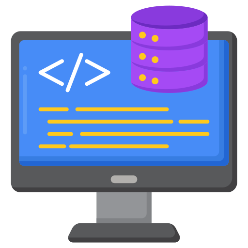

#  Backend Guidelines
###### *This guidelines will help the Back-end Software Engineering Division to craft their code and will be use on the company's KPI and technical compliance.*

## Contents
* #### **PHP**
    * [Principles](#principle)
        *  [SOLID](#solid)
        *  [Don't Repeat Yourself (DRY)](#dont-repeat-yourself-dry)
        *  [KISS (Keep It Simple, Stupid)](#kiss-keep-it-simple-stupid)
    * [PSR-12: Extended Coding Style](#psr-12-extended-coding-style)
    * [Do's and Dont's](#dos-and-donts)
*  [Laravel](#laravel)
*  [Testing](#testing)
*  [Version Control (Git) ](#version-control-git)
*  [Postman API Documentation](#postman-api-documentation)
*  **Microservice**
*  **Typescript <span style="color:red">(Coming Soon!)</span>.**

# Principles

## SOLID
#### <span style="color:green">Single Responsibility Principle (SRP)</span>

As stated in Clean Code, "**There should never be more than one reason for a class to change**". It's tempting to jam-pack a class with a lot of functionality, like when you can only take one suitcase on your flight. The issue with this is that your class won't be conceptually cohesive and it will give it many reasons to change. Minimizing the amount of times you need to change a class is important. It's important because if too much functionality is in one class and you modify a piece of it, it can be difficult to understand how that will affect other dependent modules in your codebase.

**Bad:**

```
class UserSettings
{
    private $user;

    public function __construct(User $user)
    {
        $this->user = $user;
    }

    public function changeSettings(array $settings): void
    {
        if ($this->verifyCredentials()) {
            // ...
        }
    }

    private function verifyCredentials(): bool
    {
        // ...
    }
}
```

**Good:**

```
class UserAuth
{
    private $user;

    public function __construct(User $user)
    {
        $this->user = $user;
    }

    public function verifyCredentials(): bool
    {
        // ...
    }
}

class UserSettings
{
    private $user;

    private $auth;

    public function __construct(User $user)
    {
        $this->user = $user;
        $this->auth = new UserAuth($user);
    }

    public function changeSettings(array $settings): void
    {
        if ($this->auth->verifyCredentials()) {
            // ...
        }
    }
}
```
#### <span style="color:green">Open/Closed Principle (OCP)</span>

As stated by Bertrand Meyer, "software entities (classes, modules, functions, etc.) should be **open for extension, but closed for modification**." What does that mean though? This principle basically states that you should allow users to add new functionalities without changing existing code.

**Bad:**

```
abstract class Adapter
{
    protected $name;

    public function getName(): string
    {
        return $this->name;
    }
}

class AjaxAdapter extends Adapter
{
    public function __construct()
    {
        parent::__construct();

        $this->name = 'ajaxAdapter';
    }
}

class NodeAdapter extends Adapter
{
    public function __construct()
    {
        parent::__construct();

        $this->name = 'nodeAdapter';
    }
}

class HttpRequester
{
    private $adapter;

    public function __construct(Adapter $adapter)
    {
        $this->adapter = $adapter;
    }

    public function fetch(string $url): Promise
    {
        $adapterName = $this->adapter->getName();

        if ($adapterName === 'ajaxAdapter') {
            return $this->makeAjaxCall($url);
        } elseif ($adapterName === 'httpNodeAdapter') {
            return $this->makeHttpCall($url);
        }
    }

    private function makeAjaxCall(string $url): Promise
    {
        // request and return promise
    }

    private function makeHttpCall(string $url): Promise
    {
        // request and return promise
    }
}
```

**Good:**

```
interface Adapter
{
    public function request(string $url): Promise;
}

class AjaxAdapter implements Adapter
{
    public function request(string $url): Promise
    {
        // request and return promise
    }
}

class NodeAdapter implements Adapter
{
    public function request(string $url): Promise
    {
        // request and return promise
    }
}

class HttpRequester
{
    private $adapter;

    public function __construct(Adapter $adapter)
    {
        $this->adapter = $adapter;
    }

    public function fetch(string $url): Promise
    {
        return $this->adapter->request($url);
    }
}
```
#### <span style="color:green">Liskov Substitution Principle (LSP)</span>

This is a scary term for a very simple concept. It's formally defined as "If S is a subtype of T, then objects of type T may be replaced with objects of type S (i.e., objects of type S may substitute objects of type T) without altering any of the desirable properties of that program (correctness, task performed, etc.)." That's an even scarier definition.

The best explanation for this is if you have a parent class and a child class, then the base class and child class can be used interchangeably without getting incorrect results. This might still be confusing, so let's take a look at the classic Square-Rectangle example. Mathematically, a square is a rectangle, but if you model it using the "is-a" relationship via inheritance, you quickly get into trouble.

**Bad:**

```
class Rectangle
{
    protected $width = 0;

    protected $height = 0;

    public function setWidth(int $width): void
    {
        $this->width = $width;
    }

    public function setHeight(int $height): void
    {
        $this->height = $height;
    }

    public function getArea(): int
    {
        return $this->width * $this->height;
    }
}

class Square extends Rectangle
{
    public function setWidth(int $width): void
    {
        $this->width = $this->height = $width;
    }

    public function setHeight(int $height): void
    {
        $this->width = $this->height = $height;
    }
}

function printArea(Rectangle $rectangle): void
{
    $rectangle->setWidth(4);
    $rectangle->setHeight(5);

    // BAD: Will return 25 for Square. Should be 20.
    echo sprintf('%s has area %d.', get_class($rectangle), $rectangle->getArea()) . PHP_EOL;
}

$rectangles = [new Rectangle(), new Square()];

foreach ($rectangles as $rectangle) {
    printArea($rectangle);
}
```

**Good:**

The best way is separate the quadrangles and allocation of a more general subtype for both shapes.

Despite the apparent similarity of the square and the rectangle, they are different. A square has much in common with a rhombus, and a rectangle with a parallelogram, but they are not subtypes. A square, a rectangle, a rhombus and a parallelogram are separate shapes with their own properties, albeit similar.

```
interface Shape
{
    public function getArea(): int;
}

class Rectangle implements Shape
{
    private $width = 0;
    private $height = 0;

    public function __construct(int $width, int $height)
    {
        $this->width = $width;
        $this->height = $height;
    }

    public function getArea(): int
    {
        return $this->width * $this->height;
    }
}

class Square implements Shape
{
    private $length = 0;

    public function __construct(int $length)
    {
        $this->length = $length;
    }

    public function getArea(): int
    {
        return $this->length ** 2;
    }
}

function printArea(Shape $shape): void
{
    echo sprintf('%s has area %d.', get_class($shape), $shape->getArea()).PHP_EOL;
}

$shapes = [new Rectangle(4, 5), new Square(5)];

foreach ($shapes as $shape) {
    printArea($shape);
}
```
#### <span style="color:green">Interface Segregation Principle (ISP)</span>

ISP states that "Clients should not be forced to depend upon interfaces that they do not use."

A good example to look at that demonstrates this principle is for classes that require large settings objects. Not requiring clients to set up huge amounts of options is beneficial, because most of the time they won't need all of the settings. Making them optional helps prevent having a "fat interface".

**Bad:**

```
interface Employee
{
    public function work(): void;

    public function eat(): void;
}

class HumanEmployee implements Employee
{
    public function work(): void
    {
        // ....working
    }

    public function eat(): void
    {
        // ...... eating in lunch break
    }
}

class RobotEmployee implements Employee
{
    public function work(): void
    {
        //.... working much more
    }

    public function eat(): void
    {
        //.... robot can't eat, but it must implement this method
    }
}
```

**Good:**

Not every worker is an employee, but every employee is a worker.

```
interface Workable
{
    public function work(): void;
}

interface Feedable
{
    public function eat(): void;
}

interface Employee extends Feedable, Workable
{
}

class HumanEmployee implements Employee
{
    public function work(): void
    {
        // ....working
    }

    public function eat(): void
    {
        //.... eating in lunch break
    }
}

// robot can only work
class RobotEmployee implements Workable
{
    public function work(): void
    {
        // ....working
    }
}
```
#### <span style="color:green">Dependency Inversion Principle (DIP)</span>

This principle states two essential things:

High-level modules should not depend on low-level modules. Both should depend on abstractions.
Abstractions should not depend upon details. Details should depend on abstractions.
This can be hard to understand at first, but if you've worked with PHP frameworks (like Symfony), you've seen an implementation of this principle in the form of Dependency Injection (DI). While they are not identical concepts, DIP keeps high-level modules from knowing the details of its low-level modules and setting them up. It can accomplish this through DI. A huge benefit of this is that it reduces the coupling between modules. Coupling is a very bad development pattern because it makes your code hard to refactor.

**Bad:**

```
class Employee
{
    public function work(): void
    {
        // ....working
    }
}

class Robot extends Employee
{
    public function work(): void
    {
        //.... working much more
    }
}

class Manager
{
    private $employee;

    public function __construct(Employee $employee)
    {
        $this->employee = $employee;
    }

    public function manage(): void
    {
        $this->employee->work();
    }
}
```

**Good:**

```
interface Employee
{
    public function work(): void;
}

class Human implements Employee
{
    public function work(): void
    {
        // ....working
    }
}

class Robot implements Employee
{
    public function work(): void
    {
        //.... working much more
    }
}

class Manager
{
    private $employee;

    public function __construct(Employee $employee)
    {
        $this->employee = $employee;
    }

    public function manage(): void
    {
        $this->employee->work();
    }
}
```

## Dont' Repeat Yourself (DRY)

Do your absolute best to avoid duplicate code. Duplicate code is bad because it means that there's more than one place to alter something if you need to change some logic.

Imagine if you run a restaurant and you keep track of your inventory: all your tomatoes, onions, garlic, spices, etc. If you have multiple lists that you keep this on, then all have to be updated when you serve a dish with tomatoes in them. If you only have one list, there's only one place to update!

Often you have duplicate code because you have two or more slightly different things, that share a lot in common, but their differences force you to have two or more separate functions that do much of the same things. Removing duplicate code means creating an abstraction that can handle this set of different things with just one function/module/class.

Getting the abstraction right is critical, that's why you should follow the SOLID principles laid out in the Classes section. Bad abstractions can be worse than duplicate code, so be careful! Having said this, if you can make a good abstraction, do it! Don't repeat yourself, otherwise you'll find yourself updating multiple places any time you want to change one thing.

**Bad:**

```
function showDeveloperList(array $developers): void
{
    foreach ($developers as $developer) {
        $expectedSalary = $developer->calculateExpectedSalary();
        $experience = $developer->getExperience();
        $githubLink = $developer->getGithubLink();
        $data = [$expectedSalary, $experience, $githubLink];

        render($data);
    }
}

function showManagerList(array $managers): void
{
    foreach ($managers as $manager) {
        $expectedSalary = $manager->calculateExpectedSalary();
        $experience = $manager->getExperience();
        $githubLink = $manager->getGithubLink();
        $data = [$expectedSalary, $experience, $githubLink];

        render($data);
    }
}
```

**Good:**

```
function showList(array $employees): void
{
    foreach ($employees as $employee) {
        $expectedSalary = $employee->calculateExpectedSalary();
        $experience = $employee->getExperience();
        $githubLink = $employee->getGithubLink();
        $data = [$expectedSalary, $experience, $githubLink];

        render($data);
    }
}
```

**Very Good:**

```
function showList(array $employees): void
{
    foreach ($employees as $employee) {
        render([$employee->calculateExpectedSalary(), $employee->getExperience(), $employee->getGithubLink()]);
    }
}
```

## KISS (Keep it Simple, Stupid)

The **KISS principle** is also a fundamental guideline in software engineering that emphasizes simplicity in design and implementation. It advocates for avoiding unnecessary complexity and striving for straightforward solutions. Adopting the **KISS principle** can significantly benefit software development projects in the following ways:

Enhanced Understanding: Simple code is easier to understand. When software is designed with simplicity in mind, developers can quickly grasp its logic and functionality.

Improved Maintainability: Complex code tends to be difficult to maintain over time. With each added layer of complexity, the probability of introducing bugs or unintended side effects increases. On the other hand, adhering to the KISS principle ensures that code remains manageable and maintainable, even as the project evolves.

# PSR-12: Extended Coding Style

The key words **"MUST"**, **"MUST NOT"**, **"REQUIRED"**, **"SHALL"**, **"SHALL NOT"**, **"SHOULD"**, **"SHOULD NOT"**, **"RECOMMENDED"**, **"MAY"**, and **"OPTIONAL"** in this document are to be interpreted as described in [RFC 2119](https://datatracker.ietf.org/doc/html/rfc2119).


#### <span style="color:green">Basic Coding Standard</span>

* Code **MUST** follow all rules outlined in PSR-1.

* The term '**StudlyCaps**' in PSR-1 **MUST** be interpreted as **PascalCase** where the first letter of each word is capitalized including the very first letter.

#### <span style="color:green">Files</span>

* All PHP files **MUST** use the Unix LF (linefeed) line ending only.
* All PHP files **MUST** end with a non-blank line, terminated with a single LF.
* The closing **?>** tag **MUST** be omitted from files containing only PHP.

#### <span style="color:green">Lines</span>

* There **MUST NOT** be a hard limit on line length.

* The soft limit on line length **MUST** be [120 characters](# 'ADD this in your VSCode settings.json "editor.rulers": [80,120]').

* Lines **SHOULD NOT** be longer than [80 characters](# 'ADD this in your VSCode settings.json "editor.rulers": [80,120]'); lines longer than that **SHOULD** be split into multiple subsequent lines of no more than [80 characters](# 'ADD this in your VSCode settings.json "editor.rulers": [80,120]') each.

* There **MUST NOT** be trailing whitespace at the [end of lines](# 'ADD this in your VSCode settings.json "files.trimTrailingWhitespace": true').

* Blank lines **MAY** be added to improve readability and to indicate related blocks of code except where explicitly forbidden.

* There **MUST NOT** be more than one statement per line.

#### <span style="color:green">Indenting</span>

* Code **MUST** use an indent of 4 spaces for each indent level, and **MUST NOT** use tabs for indenting.

#### <span style="color:green">Keywords and Types</span>

* All PHP reserved keywords and types **MUST** be in lower case.

* Any new types and keywords added to future PHP versions **MUST** be in lower case.

* Short form of type keywords **MUST** be used i.e. bool instead of boolean, int instead of integer etc.

#### <span style="color:green">Declare Statements, Namespace and Import Statements</span>

The header of a PHP file may consist of a number of different blocks. If present, each of the blocks below **MUST** be separated by a single blank line, and **MUST NOT** contain a blank line. Each block **MUST** be in the order listed below, although blocks that are not relevant may be omitted.

* Opening ```<?php``` tag.
* File-level docblock.
* One or more declare statements.
* The namespace declaration of the file.
* One or more class-based use import statements.
* One or more function-based use import statements.
* One or more constant-based use import statements.
* The remainder of the code in the file.


When the opening ```<?php``` tag is on the first line of the file, it **MUST** be on its own line with no other statements unless it is a file containing markup outside of PHP opening and closing tags.

Import statements **MUST** never begin with a leading backslash as they must always be fully qualified.


#### <span style="color:green">Classes, Properties, and Methods</span>

The term "class" refers to all **classes, interfaces, and traits**.

Any closing brace **MUST NOT** be followed by any comment or statement on the same line.

When instantiating a new class, parentheses **MUST** always be present even when there are no arguments passed to the constructor.

```
new Foo();
```


#### <span style="color:green">Extends and Implements</span>

The extends and implements keywords **MUST** be declared on the same line as the class name.

The opening brace for the class **MUST** go on its own line; the closing brace for the class **MUST** go on the next line after the body.

Opening braces **MUST** be on their own line and **MUST NOT** be preceded or followed by a blank line.

Closing braces **MUST** be on their own line and **MUST NOT** be preceded by a blank line.

```
?php

namespace Vendor\Package;

use FooClass;
use BarClass as Bar;
use OtherVendor\OtherPackage\BazClass;

class ClassName extends ParentClass implements \ArrayAccess, \Countable
{
    // constants, properties, methods
}
```

Lists of ```implements``` and, in the case of interfaces, ```extends``` **MAY** be split across multiple lines, where each subsequent line is indented once. When doing so, the first item in the list **MUST** be on the next line, and there **MUST** be only one interface per line.

```
<?php

namespace Vendor\Package;

use FooClass;
use BarClass as Bar;
use OtherVendor\OtherPackage\BazClass;

class ClassName extends ParentClass implements
    \ArrayAccess,
    \Countable,
    \Serializable
{
    // constants, properties, methods
}
```

#### <span style="color:green">Using Traits</span>

The ```use``` keyword used inside the classes to implement traits **MUST** be declared on the next line after the opening brace.

```
<?php

namespace Vendor\Package;

use Vendor\Package\FirstTrait;

class ClassName
{
    use FirstTrait;
}
```

Each individual trait that is imported into a class **MUST** be included one-per-line and each inclusion **MUST** have its own ```use``` import statement.

```
<?php

namespace Vendor\Package;

use Vendor\Package\FirstTrait;
use Vendor\Package\SecondTrait;
use Vendor\Package\ThirdTrait;

class ClassName
{
    use FirstTrait;
    use SecondTrait;
    use ThirdTrait;
}
```

When the class has nothing after the use import statement, the class closing brace **MUST** be on the next line after the ```use``` import statement.

```
<?php

namespace Vendor\Package;

use Vendor\Package\FirstTrait;

class ClassName
{
    use FirstTrait;
}

```

Otherwise, it **MUST** have a blank line after the ```use``` import statement.

```
<?php

namespace Vendor\Package;

use Vendor\Package\FirstTrait;

class ClassName
{
    use FirstTrait;

    private $property;
}
```

#### <span style="color:green">Properties and Constants</span>

Visibility **MUST** be declared on all properties.

Visibility **MUST** be declared on all constants if your project PHP minimum version supports constant visibilities (PHP 7.1 or later).

The ```var``` keyword **MUST NOT** be used to declare a property.

There **MUST NOT** be more than one property declared per statement.

Property names **MUST NOT** be prefixed with a single underscore to indicate protected or private visibility. That is, an underscore prefix explicitly has no meaning.

There **MUST** be a space between type declaration and property name.
\
A property declaration looks like the following:

```
<?php

namespace Vendor\Package;

class ClassName
{
    public $foo = null;
    public static int $bar = 0;
}
```

#### <span style="color:green">Methods and Functions</span>

Visibility **MUST** be declared on all methods.

Method names **MUST NOT** be prefixed with a single underscore to indicate protected or private visibility. That is, an underscore prefix explicitly has no meaning.

Method and function names **MUST NOT** be declared with space after the method name. The opening brace MUST go on its own line, and the closing brace MUST go on the next line following the body. There **MUST NOT** be a space after the opening parenthesis, and there **MUST NOT** be a space before the closing parenthesis.
\
A method declaration looks like the following. **Note the placement of parentheses, commas, spaces, and braces**:

```
<?php

namespace Vendor\Package;

class ClassName
{
    public function fooBarBaz($arg1, &$arg2, $arg3 = [])
    {
        // method body
    }
}
```

Argument lists **MAY** be split across multiple lines, where each subsequent line is indented once. When doing so, the first item in the list **MUST** be on the next line, and there **MUST** be only one argument per line.

When the argument list is split across multiple lines, the closing parenthesis and opening brace **MUST** be placed together on their own line with one space between them.

```
<?php

namespace Vendor\Package;

class ClassName
{
    public function aVeryLongMethodName(
        ClassTypeHint $arg1,
        &$arg2,
        array $arg3 = []
    ) {
        // method body
    }
}
```

When you have a return type declaration present, there **MUST** be one space after the colon followed by the type declaration. The colon and declaration **MUST** be on the same line as the argument list closing parenthesis with no spaces between the two characters.

```
<?php

declare(strict_types=1);

namespace Vendor\Package;

class ReturnTypeVariations
{
    public function functionName(int $arg1, $arg2): string
    {
        return 'foo';
    }

    public function anotherFunction(
        string $foo,
        string $bar,
        int $baz
    ): string {
        return 'foo';
    }
}
```

In nullable type declarations, there **MUST NOT** be a space between the question mark and the type.

```
<?php

declare(strict_types=1);

namespace Vendor\Package;

class ReturnTypeVariations
{
    public function functionName(?string $arg1, ?int &$arg2): ?string
    {
        return 'foo';
    }
}

```

When using the reference operator ```&``` before an argument, there **MUST NOT** be a space after it, like in the previous example.

There **MUST NOT** be a space between the variadic three dot operator and the argument name:

```
public function process(string $algorithm, ...$parts)
{
    // processing
}
```

When combining both the reference operator and the variadic three dot operator, there **MUST NOT** be any space between the two of them:

```
public function process(string $algorithm, ...$parts)
{
    // processing
}
```

#### <span style="color:green">Methods and Functions Calls</span>

When making a method or function call, there **MUST NOT** be a space between the method or function name and the opening parenthesis, there **MUST NOT** be a space after the opening parenthesis, and there **MUST NOT** be a space before the closing parenthesis. In the argument list, there **MUST NOT** be a space before each comma, and there **MUST** be one space after each comma.

```
<?php

bar();
$foo->bar($arg1);
Foo::bar($arg2, $arg3);
```

Argument lists **MAY** be split across multiple lines, where each subsequent line is indented once. When doing so, the first item in the list MUST be on the next line, and there MUST be only one argument per line. A single argument being split across multiple lines (as might be the case with an anonymous function or array) does not constitute splitting the argument list itself.

```
<?php

$foo->bar(
    $longArgument,
    $longerArgument,
    $muchLongerArgument
);
```
```
<?php

somefunction($foo, $bar, [
  // ...
], $baz);

$app->get('/hello/{name}', function ($name) use ($app) {
    return 'Hello ' . $app->escape($name);
});
```

#### <span style="color:green">Control Structures</span>

The general style rules for control structures are as follows:

* There **MUST** be one space after the control structure keyword
* There **MUST NOT** be a space after the opening parenthesis
* There **MUST NOT** be a space before the closing parenthesis
* There **MUST** be one space between the closing parenthesis and the opening brace
* The structure body **MUST** be indented once
* The body **MUST** be on the next line after the opening brace
* The closing brace **MUST** be on the next line after the body

##### ```if```

An ```if``` structure looks like the following. **Note the placement of parentheses, spaces, and braces**. ```elseif``` and ```else``` **MUST NOT** not be used and do an early return instead.

```
<?php`

if ($expr1) {
    // if body
}
```

Expressions in parentheses **MAY** be split across multiple lines, where each subsequent line is indented at least once. When doing so, the first condition **MUST** be on the next line. The closing parenthesis and opening brace **MUST** be placed together on their own line with one space between them. Boolean operators between conditions **MUST** always be at the beginning or at the end of the line, not a mix of both.

```
<?php

if (
    $expr1
    && $expr2
) {
    // if body
}
```

##### ```switch```, ```case```

A ```switch``` structure looks like the following. **Note the placement of parentheses, spaces, and braces**. The ```case``` statement **MUST** be indented once from ```switch```, and the ```break``` keyword (or other terminating keywords) **MUST** be indented at the same level as the case body. There **MUST** be a comment such as ```// no break``` when fall-through is intentional in a non-empty ```case``` body.

```
<?php

switch ($expr) {
    case 0:
        echo 'First case, with a break';
        break;
    case 1:
        echo 'Second case, which falls through';
        // no break
    case 2:
    case 3:
    case 4:
        echo 'Third case, return instead of break';
        return;
    default:
        echo 'Default case';
        break;
}
```

Expressions in parentheses **MAY** be split across multiple lines, where each subsequent line is indented at least once. When doing so, the first condition **MUST** be on the next line. The closing parenthesis and opening brace **MUST** be placed together on their own line with one space between them. Boolean operators between conditions **MUST** always be at the beginning or at the end of the line, not a mix of both.

```
<?php

switch (
    $expr1
    && $expr2
) {
    // structure body
}
```

##### ```while```, ```do while```

A ```while``` and ```do while``` statement looks like the following. **Note the placement of parentheses, spaces, and braces**.

```
<?php

while ($expr) {
    // structure body
}
```

```
<?php

do {
    // structure body;
} while ($expr);
```


Expressions in parentheses **MAY** be split across multiple lines, where each subsequent line is indented at least once. When doing so, the first condition **MUST** be on the next line. The closing parenthesis and opening brace **MUST** be placed together on their own line with one space between them. Boolean operators between conditions **MUST** always be at the beginning or at the end of the line, not a mix of both.

```
<?php

while (
    $expr1
    && $expr2
) {
    // structure body
}
```

```
<?php

do {
    // structure body;
} while (
    $expr1
    && $expr2
);
```

##### ```for```

A ```for``` statement looks like the following. **Note the placement of parentheses, spaces, and braces**.

```
<?php

for ($i = 0; $i < 10; $i++) {
    // for body
}
```

##### ```foreach```

A ```foreach``` statement looks like the following. **Note the placement of parentheses, spaces, and braces**.

```
<?php

foreach ($iterable as $key => $value) {
    // foreach body
}
```

##### ```try```, ```catch```, ```finally```

A ```try-catch-finally``` block looks like the following. **Note the placement of parentheses, spaces, and braces**.

```
<?php

try {
    // try body
} catch (FirstThrowableType $e) {
    // catch body
} catch (OtherThrowableType | AnotherThrowableType $e) {
    // catch body
} finally {
    // finally body
}
```

#### <span style="color:green">Operators</span>

Style rules for operators are grouped by arity (the number of operands they take).

When space is permitted around an operator, multiple spaces **MAY** be used for readability purposes.

All operators not described here are left undefined.

The increment/decrement operators **MUST NOT** have any space between the operator and operand.

```
$i++;
++$j;
```

Type casting operators **MUST NOT** have any space within the parentheses:

```
$intValue = (int) $input;
```

##### ```Binary Operators```

All **binary arithmetic, comparison, assignment, bitwise, logical, string, and type operators** **MUST** be preceded and followed by at least one space:

```
if ($a === $b) {
    $foo = $bar ?? $a ?? $b;
} elseif ($a > $b) {
    $foo = $a + $b * $c;
}
```

##### ```Ternary Operators```

The conditional operator, also known simply as the ternary operator, **MUST** be preceded and followed by at least one space around both the``` ?``` and ```:``` characters:

```
$variable = $foo ? 'foo' : 'bar';
```

When the middle operand of the conditional operator is omitted, the operator **MUST** follow the same style rules as other binary comparison operators:

```
$variable = $foo ?: 'bar';
```

#### <span style="color:green">Closures</span>

Closures **MUST** be declared with a space after the ```function``` keyword, and a space before and after the ```use``` keyword.

The opening brace **MUST** go on the same line, and the closing brace **MUST** go on the next line following the body.

There **MUST NOT** be a space after the opening parenthesis of the argument list or variable list, and there **MUST NOT** be a space before the closing parenthesis of the argument list or variable list.

In the argument list and variable list, there **MUST NOT** be a space before each comma, and there **MUST** be one space after each comma.

Closure arguments with default values **MUST** go at the end of the argument list.

If a return type is present, it **MUST** follow the same rules as with normal functions and methods; if the ```use``` keyword is present, the colon **MUST** follow the ```use``` list closing parentheses with no spaces between the two characters.

A closure declaration looks like the following. **Note the placement of parentheses, commas, spaces, and braces**:

```
<?php

$closureWithArgs = function ($arg1, $arg2) {
    // body
};

$closureWithArgsAndVars = function ($arg1, $arg2) use ($var1, $var2) {
    // body
};

$closureWithArgsVarsAndReturn = function ($arg1, $arg2) use ($var1, $var2): bool {
    // body
};
```

Argument lists and variable lists **MAY** be split across multiple lines, where each subsequent line is indented once. When doing so, the first item in the list **MUST** be on the next line, and there **MUST** be only one argument or variable per line.

When the ending list (whether of arguments or variables) is split across multiple lines, the closing parenthesis and opening brace **MUST** be placed together on their own line with one space between them.

The following are examples of closures with and without argument lists and variable lists split across multiple lines.

```
<?php

$longArgs_noVars = function (
    $longArgument,
    $longerArgument,
    $muchLongerArgument
) {
   // body
};

$noArgs_longVars = function () use (
    $longVar1,
    $longerVar2,
    $muchLongerVar3
) {
   // body
};

$longArgs_longVars = function (
    $longArgument,
    $longerArgument,
    $muchLongerArgument
) use (
    $longVar1,
    $longerVar2,
    $muchLongerVar3
) {
   // body
};

$longArgs_shortVars = function (
    $longArgument,
    $longerArgument,
    $muchLongerArgument
) use ($var1) {
   // body
};

$shortArgs_longVars = function ($arg) use (
    $longVar1,
    $longerVar2,
    $muchLongerVar3
) {
   // body
};
```

Note that the formatting rules also apply when the closure is used directly in a function or method call as an argument.

```
<?php

$foo->bar(
    $arg1,
    function ($arg2) use ($var1) {
        // body
    },
    $arg3
);
```

#### <span style="color:green">Anonymous Classes</span>

Anonymous Classes **MUST** follow the same guidelines and principles as closures in the above section.

```
<?php

$instance = new class {};
```

The opening brace **MAY** be on the same line as the ```class``` keyword so long as the list of ```implements``` interfaces does not wrap. If the list of interfaces wraps, the brace MUST be placed on the line immediately following the last interface.

```
<?php

// Brace on the same line
$instance = new class extends \Foo implements \HandleableInterface {
    // Class content
};

// Brace on the next line
$instance = new class extends \Foo implements
    \ArrayAccess,
    \Countable,
    \Serializable
{
    // Class content
};
```

# Do's and Dont's

#### <span style="color:green">Variables</span>

**Bad:**

```
$ymdstr = $moment->format('y-m-d');
```

**Good:**

```
$currentDate = $moment->format('y-m-d');
```

#### <span style="color:green">Use the same vocabulary for the same type of variable</span>

**Bad:**

```
getUserInfo();
getUserData();
getUserRecord();
getUserProfile();
```

**Good:**

```
getUser();
```

#### <span style="color:green">Use searchable names</span>

**Bad:**

```
class User
{
    // What the heck is 7 for?
    public $access = 7;
}

// What the heck is 4 for?
if ($user->access & 4) {
    // ...
}

// What's going on here?
$user->access ^= 2;
```

**Good:**

```
class User
{
    public const ACCESS_READ = 1;

    public const ACCESS_CREATE = 2;

    public const ACCESS_UPDATE = 4;

    public const ACCESS_DELETE = 8;

    // User as default can read, create and update something
    public $access = self::ACCESS_READ | self::ACCESS_CREATE | self::ACCESS_UPDATE;
}

if ($user->access & User::ACCESS_UPDATE) {
    // do edit ...
}

// Deny access rights to create something
$user->access ^= User::ACCESS_CREATE;
```
#### <span style="color:green">Use explanatory variables</span>

**Bad:**

```
$address = 'One Infinite Loop, Cupertino 95014';
$cityZipCodeRegex = '/^[^,]+,\s*(.+?)\s*(\d{5})$/';
preg_match($cityZipCodeRegex, $address, $matches);

saveCityZipCode($matches[1], $matches[2]);
```

**Good:**

```
$address = 'One Infinite Loop, Cupertino 95014';
$cityZipCodeRegex = '/^[^,]+,\s*(?<city>.+?)\s*(?<zipCode>\d{5})$/';
preg_match($cityZipCodeRegex, $address, $matches);

saveCityZipCode($matches['city'], $matches['zipCode']);
```

#### <span style="color:green">Avoid nesting if statement</span>

**Bad:**

```
function fibonacci(int $n)
{
    if ($n < 50) {
        if ($n !== 0) {
            if ($n !== 1) {
                return fibonacci($n - 1) + fibonacci($n - 2);
            }
            return 1;
        }
        return 0;
    }
    return 'Not supported';
}
```

**Good:**

```
function fibonacci(int $n): int
{
    if ($n === 0 || $n === 1) {
        return $n;
    }

    if ($n >= 50) {
        throw new Exception('Not supported');
    }

    return fibonacci($n - 1) + fibonacci($n - 2);
}
```

#### <span style="color:green">Avoid mental mapping</span>

**Bad:**

```
$l = ['Austin', 'New York', 'San Francisco'];

for ($i = 0; $i < count($l); $i++) {
    $li = $l[$i];
    doStuff();
    doSomeOtherStuff();
    // ...
    // ...
    // ...
    // Wait, what is `$li` for again?
    dispatch($li);
}
```

**Good:**

```
$locations = ['Austin', 'New York', 'San Francisco'];

foreach ($locations as $location) {
    doStuff();
    doSomeOtherStuff();
    // ...
    // ...
    // ...
    dispatch($location);
```

#### <span style="color:green">Avoid mental mapping</span>

**Bad:**

```
class Car
{
    public $carMake;

    public $carModel;

    public $carColor;

    //...
}
```

**Good:**

```
class Car
{
    public $make;

    public $model;

    public $color;

    //...
}
```

#### <span style="color:green">Identical Comparison</span>

**Bad:**

The simple comparison will convert the string into an integer.

```
$a = '42';
$b = 42;

if ($a != $b) {
    // The expression will always pass
}
```

The comparison ```$a != $b``` returns ```FALSE``` but in fact it's ```TRUE```! The string ```42``` is different than the integer ```42```.

**Good:**

The identical comparison will compare type and value.

```
$a = '42';
$b = 42;

if ($a !== $b) {
    // The expression is verified
}
```

The comparison ```$a !== $b``` returns ```TRUE```.

#### <span style="color:green">Null coalescing operator</span>

**Bad:**

```
if (isset($_GET['name'])) {
    $name = $_GET['name'];
} elseif (isset($_POST['name'])) {
    $name = $_POST['name'];
} else {
    $name = 'nobody';
}
```

**Good:**

```
$name = $_GET['name'] ?? $_POST['name'] ?? 'nobody';
```

#### <span style="color:green">Functions</span>

Use default arguments instead of short circuiting or conditionals

**Not good:**

This is not good because ```$breweryName``` can be ```NULL```.

```
function createMicrobrewery($breweryName = 'Hipster Brew Co.'): void
{
    // ...
}
```

**Not bad:**

This opinion is more understandable than the previous version, but it better controls the value of the variable.

```
function createMicrobrewery($name = null): void
{
    $breweryName = $name ?: 'Hipster Brew Co.';
    // ...
}
```

**Good:**

You can use type hinting and be sure that the ```$breweryName``` will not be ```NULL```.

```
function createMicrobrewery(string $breweryName = 'Hipster Brew Co.'): void
{
    // ...
}
```

##### **Function arguments (2 or fewer ideally)**

Limiting the amount of function parameters is incredibly important because it makes testing your function easier. Having more than three leads to a combinatorial explosion where you have to test tons of different cases with each separate argument.

Zero arguments is the ideal case. One or two arguments is ok, and three should be avoided. Anything more than that should be consolidated. Usually, if you have more than two arguments then your function is trying to do too much. In cases where it's not, most of the time a higher-level object will suffice as an argument.

**Bad:**

```
class Questionnaire
{
    public function __construct(
        string $firstname,
        string $lastname,
        string $patronymic,
        string $region,
        string $district,
        string $city,
        string $phone,
        string $email
    ) {
        // ...
    }
}
```

**Good:**

```
class Name
{
    private $firstname;

    private $lastname;

    private $patronymic;

    public function __construct(string $firstname, string $lastname, string $patronymic)
    {
        $this->firstname = $firstname;
        $this->lastname = $lastname;
        $this->patronymic = $patronymic;
    }

    // getters ...
}

class City
{
    private $region;

    private $district;

    private $city;

    public function __construct(string $region, string $district, string $city)
    {
        $this->region = $region;
        $this->district = $district;
        $this->city = $city;
    }

    // getters ...
}

class Contact
{
    private $phone;

    private $email;

    public function __construct(string $phone, string $email)
    {
        $this->phone = $phone;
        $this->email = $email;
    }

    // getters ...
}

class Questionnaire
{
    public function __construct(Name $name, City $city, Contact $contact)
    {
        // ...
    }
}
```

##### **Function names should say what they do**

**Bad:**

```
class Email
{
    //...

    public function handle(): void
    {
        mail($this->to, $this->subject, $this->body);
    }
}

$message = new Email(...);
// What is this? A handle for the message? Are we writing to a file now?
$message->handle();
```

**Good:**

```
class Email
{
    //...

    public function send(): void
    {
        mail($this->to, $this->subject, $this->body);
    }
}

$message = new Email(...);
// Clear and obvious
$message->send();
```

##### **Encapsulate conditionals**

**Bad:**

```
if ($article->state === 'published') {
    // ...
}
```

**Good:**

```
if ($article->isPublished()) {
    // ...
}
```

##### **Avoid conditionals**

This seems like an impossible task. Upon first hearing this, most people say, "how am I supposed to do anything without an ```if``` statement?" The answer is that you can use polymorphism to achieve the same task in many cases. The second question is usually, "well that's great but why would I want to do that?" The answer is a previous clean code concept we learned: a function should only do one thing. When you have classes and functions that have ```if``` statements, you are telling your user that your function does more than one thing. Remember, just do one thing.

**Bad:**

```
class Airplane
{
    // ...

    public function getCruisingAltitude(): int
    {
        switch ($this->type) {
            case '777':
                return $this->getMaxAltitude() - $this->getPassengerCount();
            case 'Air Force One':
                return $this->getMaxAltitude();
            case 'Cessna':
                return $this->getMaxAltitude() - $this->getFuelExpenditure();
        }
    }
}
```

**Good:**

```
interface Airplane
{
    // ...

    public function getCruisingAltitude(): int;
}

class Boeing777 implements Airplane
{
    // ...

    public function getCruisingAltitude(): int
    {
        return $this->getMaxAltitude() - $this->getPassengerCount();
    }
}

class AirForceOne implements Airplane
{
    // ...

    public function getCruisingAltitude(): int
    {
        return $this->getMaxAltitude();
    }
}

class Cessna implements Airplane
{
    // ...

    public function getCruisingAltitude(): int
    {
        return $this->getMaxAltitude() - $this->getFuelExpenditure();
    }
}
```

##### **Avoid type-checking**

PHP is untyped, which means your functions can take any type of argument. Sometimes you are bitten by this freedom and it becomes tempting to do type-checking in your functions. There are many ways to avoid having to do this. The first thing to consider is consistent APIs.

**Bad:**

```
function travelToTexas($vehicle): void
{
    if ($vehicle instanceof Bicycle) {
        $vehicle->pedalTo(new Location('texas'));
    } elseif ($vehicle instanceof Car) {
        $vehicle->driveTo(new Location('texas'));
    }
}
```

**Good:**

```
function travelToTexas(Vehicle $vehicle): void
{
    $vehicle->travelTo(new Location('texas'));
}
```

If you are working with basic primitive values like strings, integers, and arrays, and you use PHP 7+ and you can't use polymorphism but you still feel the need to type-check, you should consider [type declaration](https://www.php.net/manual/en/language.types.declarations.php) or strict mode. It provides you with static typing on top of standard PHP syntax. The problem with manually type-checking is that doing it will require so much extra verbiage that the faux "type-safety" you get doesn't make up for the lost readability. Keep your PHP clean, write good tests, and have good code reviews. Otherwise, do all of that but with PHP strict type declaration or strict mode.

**Bad:**

```
function combine($val1, $val2): int
{
    if (! is_numeric($val1) || ! is_numeric($val2)) {
        throw new Exception('Must be of type Number');
    }

    return $val1 + $val2;
}
```

**Good:**

```
function combine(int $val1, int $val2): int
{
    return $val1 + $val2;
}
```

**Remove dead code**

ead code is just as bad as duplicate code. There's no reason to keep it in your codebase. If it's not being called, get rid of it! It will still be safe in your version history if you still need it.

**Bad:**

```
function oldRequestModule(string $url): void
{
    // ...
}

function newRequestModule(string $url): void
{
    // ...
}

$request = newRequestModule($requestUrl);
inventoryTracker('apples', $request, 'www.inventory-awesome.io');
```

**Good:**

```
function requestModule(string $url): void
{
    // ...
}

$request = requestModule($requestUrl);
inventoryTracker('apples', $request, 'www.inventory-awesome.io');
```

#### <span style="color:green">Object and Data Structures</span>

##### **Use object encapsulation**

In PHP you can set ```public```, ```protected``` and ```private``` keywords for methods. Using it, you can control properties modification on an object.

* When you want to do more beyond getting an object property, you don't have to look up and change every accessor in your codebase.
* Makes adding validation simple when doing a set.
* Encapsulates the internal representation.
* Easy to add logging and error handling when getting and setting.
* Inheriting this class, you can override default functionality.
* You can lazy load your object's properties, let's say getting it from a server.
Additionally, this is part of Open/Closed principle.

**Bad:**

```
class BankAccount
{
    public $balance = 1000;
}

$bankAccount = new BankAccount();

// Buy shoes...
$bankAccount->balance -= 100;
```

**Good:**

```
class BankAccount
{
    private $balance;

    public function __construct(int $balance = 1000)
    {
      $this->balance = $balance;
    }

    public function withdraw(int $amount): void
    {
        if ($amount > $this->balance) {
            throw new \Exception('Amount greater than available balance.');
        }

        $this->balance -= $amount;
    }

    public function deposit(int $amount): void
    {
        $this->balance += $amount;
    }

    public function getBalance(): int
    {
        return $this->balance;
    }
}

$bankAccount = new BankAccount();

// Buy shoes...
$bankAccount->withdraw($shoesPrice);

// Get balance
$balance = $bankAccount->getBalance();
```

##### **Make objects have private/protected members**

* ```public``` methods and properties are most dangerous for changes, because some outside code may easily rely on them and you can't control what code relies on them. **Modifications in class are dangerous for all users of class**.
* ```protected``` modifier are as dangerous as public, because they are available in scope of any child class. This effectively means that difference between public and protected is only in access mechanism, but encapsulation guarantee remains the same. **Modifications in class are dangerous for all descendant classes**.
* ```private``` modifier guarantees that code is dangerous to modify only in boundaries of single class.
Therefore, use ```private``` by default and ```public/protected``` when you need to provide access for external classes.

**Bad:**

```
class Employee
{
    public $name;

    public function __construct(string $name)
    {
        $this->name = $name;
    }
}

$employee = new Employee('John Doe');
// Employee name: John Doe
echo 'Employee name: ' . $employee->name;
```

**Good:**

```
class Employee
{
    private $name;

    public function __construct(string $name)
    {
        $this->name = $name;
    }

    public function getName(): string
    {
        return $this->name;
    }
}

$employee = new Employee('John Doe');
// Employee name: John Doe
echo 'Employee name: ' . $employee->getName();
```

#### <span style="color:green">Classes</span>
##### **Prefer composition over inheritance**

 you should prefer composition over inheritance where you can. There are lots of good reasons to use inheritance and lots of good reasons to use composition. The main point for this maxim is that if your mind instinctively goes for inheritance, try to think if composition could model your problem better. In some cases it can.

You might be wondering then, "when should I use inheritance?" It depends on your problem at hand, but this is a decent list of when inheritance makes more sense than composition:

1. Your inheritance represents an "is-a" relationship and not a "has-a" relationship (Human->Animal vs. User->UserDetails).
2. You can reuse code from the base classes (Humans can move like all animals).
3. You want to make global changes to derived classes by changing a base class. (Change the caloric expenditure of all animals when they move).

**Bad:**

```
class Employee
{
    private $name;

    private $email;

    public function __construct(string $name, string $email)
    {
        $this->name = $name;
        $this->email = $email;
    }

    // ...
}

// Bad because Employees "have" tax data.
// EmployeeTaxData is not a type of Employee

class EmployeeTaxData extends Employee
{
    private $ssn;

    private $salary;

    public function __construct(string $name, string $email, string $ssn, string $salary)
    {
        parent::__construct($name, $email);

        $this->ssn = $ssn;
        $this->salary = $salary;
    }

    // ...
}
```

**Good:**

```
class EmployeeTaxData
{
    private $ssn;

    private $salary;

    public function __construct(string $ssn, string $salary)
    {
        $this->ssn = $ssn;
        $this->salary = $salary;
    }

    // ...
}

class Employee
{
    private $name;

    private $email;

    private $taxData;

    public function __construct(string $name, string $email)
    {
        $this->name = $name;
        $this->email = $email;
    }

    public function setTaxData(EmployeeTaxData $taxData): void
    {
        $this->taxData = $taxData;
    }

    // ...
}
```

# Laravel


**Single responsibility principle**

A class and a method should have only one responsibility.

**Bad:**

```
public function getFullNameAttribute(): string
{
    if (auth()->user() && auth()->user()->hasRole('client') && auth()->user()->isVerified()) {
        return 'Mr. ' . $this->first_name . ' ' . $this->middle_name . ' ' . $this->last_name;
    } else {
        return $this->first_name[0] . '. ' . $this->last_name;
    }
}
```

**Good:**

```
public function getFullNameAttribute(): string
{
    return $this->isVerifiedClient() ? $this->getFullNameLong() : $this->getFullNameShort();
}

public function isVerifiedClient(): bool
{
    return auth()->user() && auth()->user()->hasRole('client') && auth()->user()->isVerified();
}

public function getFullNameLong(): string
{
    return 'Mr. ' . $this->first_name . ' ' . $this->middle_name . ' ' . $this->last_name;
}

public function getFullNameShort(): string
{
    return $this->first_name[0] . '. ' . $this->last_name;
}
```

**Fat models, skinny controllers**

Put all DB related logic into Eloquent models.

**Bad:**

```
public function index()
{
    $clients = Client::verified()
        ->with(['orders' => function ($q) {
            $q->where('created_at', '>', Carbon::today()->subWeek());
        }])
        ->get();

    return view('index', ['clients' => $clients]);
}
```

**Good:**

```
public function index()
{
    return view('index', ['clients' => $this->client->getWithNewOrders()]);
}

class Client extends Model
{
    public function getWithNewOrders(): Collection
    {
        return $this->verified()
            ->with(['orders' => function ($q) {
                $q->where('created_at', '>', Carbon::today()->subWeek());
            }])
            ->get();
    }
}
```

**Validation**

**Bad:**

Move validation from controllers to Request classes.

```
public function store(Request $request)
{
    $request->validate([
        'title' => 'required|unique:posts|max:255',
        'body' => 'required',
        'publish_at' => 'nullable|date',
    ]);

    ...
}
```

**Good:**

```
public function store(PostRequest $request)
{
    ...
}

class PostRequest extends Request
{
    public function rules(): array
    {
        return [
            'title' => 'required|unique:posts|max:255',
            'body' => 'required',
            'publish_at' => 'nullable|date',
        ];
    }
}
```

**Business logic should be in service class**

A controller must have only one responsibility, so move business logic from controllers to service classes.

**Bad:**

```
public function store(Request $request)
{
    if ($request->hasFile('image')) {
        $request->file('image')->move(public_path('images') . 'temp');
    }

    ...
}
```

**Good:**

```
public function store(Request $request)
{
    $this->articleService->handleUploadedImage($request->file('image'));

    ...
}

class ArticleService
{
    public function handleUploadedImage($image): void
    {
        if (!is_null($image)) {
            $image->move(public_path('images') . 'temp');
        }
    }
}
```

**Don't repeat yourself (DRY)**

Reuse code when you can. SRP is helping you to avoid duplication. Also, reuse Blade templates, use Eloquent scopes etc.

**Bad:**

```
public function getActive()
{
    return $this->where('verified', 1)->whereNotNull('deleted_at')->get();
}

public function getArticles()
{
    return $this->whereHas('user', function ($q) {
            $q->where('verified', 1)->whereNotNull('deleted_at');
        })->get();
}
```

**Good:**

```
public function scopeActive($q)
{
    return $q->where('verified', true)->whereNotNull('deleted_at');
}

public function getActive(): Collection
{
    return $this->active()->get();
}

public function getArticles(): Collection
{
    return $this->whereHas('user', function ($q) {
            $q->active();
        })->get();
}
```

**Prefer to use Eloquent over using Query Builder and raw SQL queries. Prefer collections over arrays**

Eloquent allows you to write readable and maintainable code. Also, Eloquent has great built-in tools like soft deletes, events, scopes etc.

**Bad:**

```
SELECT *
FROM `articles`
WHERE EXISTS (SELECT *
              FROM `users`
              WHERE `articles`.`user_id` = `users`.`id`
              AND EXISTS (SELECT *
                          FROM `profiles`
                          WHERE `profiles`.`user_id` = `users`.`id`)
              AND `users`.`deleted_at` IS NULL)
AND `verified` = '1'
AND `active` = '1'
ORDER BY `created_at` DESC
```

**Good:**

```
Article::has('user.profile')->verified()->latest()->get();
```

**Mass assignment**

**Bad:**

```
$article = new Article;
$article->title = $request->title;
$article->content = $request->content;
$article->verified = $request->verified;

// Add category to article
$article->category_id = $category->id;
$article->save();
```

**Good:**

```
$category->article()->create($request->validated());
```

**Chunk data for data-heavy tasks**

**Bad:**

```
$users = $this->get();

foreach ($users as $user) {
    ...
}
```

**Good:**

```
$this->chunk(500, function ($users) {
    foreach ($users as $user) {
        ...
    }
});
```

**Prefer descriptive method and variable names over comments**

**Bad:**

```
// Determine if there are any joins
if (count((array) $builder->getQuery()->joins) > 0)
```

**Good:**

```
if ($this->hasJoins())
```

**Use config and language files, constants instead of text in the code**

**Bad:**

```
public function isNormal(): bool
{
    return $article->type === 'normal';
}

return back()->with('message', 'Your article has been added!');
```

**Good:**

```
public function isNormal()
{
    return $article->type === Article::TYPE_NORMAL;
}

return back()->with('message', __('app.article_added'));
```

**Follow Laravel naming conventions**

Follow [PSR standards](https://www.php-fig.org/psr/psr-12/).

Also, follow naming conventions accepted by Laravel community:

What | How | Good | Bad
------------ | ------------- | ------------- | -------------
Controller | singular | ArticleController | ~~ArticlesController~~
Route | plural | articles/1 | ~~article/1~~
Route name | snake_case with dot notation | users.show_active | ~~users.show-active, show-active-users~~
Model | singular | User | ~~Users~~
hasOne or belongsTo relationship | singular | articleComment | ~~articleComments, article_comment~~
All other relationships | plural | articleComments | ~~articleComment, article_comments~~
Table | plural | article_comments | ~~article_comment, articleComments~~
Pivot table | singular model names in alphabetical order | article_user | ~~user_article, articles_users~~
Table column | snake_case without model name | meta_title | ~~MetaTitle; article_meta_title~~
Model property | snake_case | $model->created_at | ~~$model->createdAt~~
Foreign key | singular model name with _id suffix | article_id | ~~ArticleId, id_article, articles_id~~
Primary key | - | id | ~~custom_id~~
Migration | - | 2017_01_01_000000_create_articles_table | ~~2017_01_01_000000_articles~~
Method | camelCase | getAll | ~~get_all~~
Method in resource controller | [table](https://laravel.com/docs/master/controllers#resource-controllers) | store | ~~saveArticle~~
Method in test class | camelCase | testGuestCannotSeeArticle | ~~test_guest_cannot_see_article~~
Variable | camelCase | $articlesWithAuthor | ~~$articles_with_author~~
Collection | descriptive, plural | $activeUsers = User::active()->get() | ~~$active, $data~~
Object | descriptive, singular | $activeUser = User::active()->first() | ~~$users, $obj~~
Config and language files index | snake_case | articles_enabled | ~~ArticlesEnabled; articles-enabled~~
View | kebab-case | show-filtered.blade.php | ~~showFiltered.blade.php, show_filtered.blade.php~~
Config | snake_case | google_calendar.php | ~~googleCalendar.php, google-calendar.php~~
Contract (interface) | adjective or noun | AuthenticationInterface | ~~Authenticatable, IAuthentication~~
Trait | adjective | Notifiable | ~~NotificationTrait~~
Trait [(PSR)](https://www.php-fig.org/bylaws/psr-naming-conventions/) | adjective | NotifiableTrait | ~~Notification~~
Enum | singular | UserType | ~~UserTypes~~, ~~UserTypeEnum~~
FormRequest | singular | UpdateUserRequest | ~~UpdateUserFormRequest~~, ~~UserFormRequest~~, ~~UserRequest~~
Seeder | singular | UserSeeder | ~~UsersSeeder~~

**Use shorter and more readable syntax where possible**

### **Use shorter and more readable syntax where possible**

Bad:

```php
$request->session()->get('cart');
$request->input('name');
```

Good:

```php
session('cart');
$request->name;
```

More examples:

Common syntax | Shorter and more readable syntax
------------ | -------------
`$request->input('name'), Request::get('name')` | `$request->name, request('name')`
`return Redirect::back()` | `return back()`
`is_null($object->relation) ? null : $object->relation->id` | `optional($object->relation)->id` (in PHP 8: `$object->relation?->id`)
`$request->has('value') ? $request->value : 'default';` | `$request->get('value', 'default')`
`Carbon::now(), Carbon::today()` | `now(), today()`
`App::make('Class')` | `app('Class')`
`->where('column', '=', 1)` | `->where('column', 1)`
`->orderBy('created_at', 'desc')` | `->latest()`
`->orderBy('age', 'desc')` | `->latest('age')`
`->orderBy('created_at', 'asc')` | `->oldest()`
`->select('id', 'name')->get()` | `->get(['id', 'name'])`
`->first()->name` | `->value('name')`

**Use IoC / Service container instead of new Class**

new Class syntax creates tight coupling between classes and complicates testing. Use IoC container or facades instead.

**Bad:**

```
$user = new User;
$user->create($request->validated());
```

**Good:**

```
public function __construct(User $user)
{
    $this->user = $user;
}

...

$this->user->create($request->validated());
```

**Do not get data from the ```.env``` file directly**

**Bad:**

```
$apiKey = env('API_KEY');
```

**Good:**

```
// config/api.php
'key' => env('API_KEY'),

// Use the data
$apiKey = config('api.key');
```

**Store dates in the standard format. Use accessors and mutators to modify date format**

A date as a string is less reliable than an object instance, e.g. a Carbon-instance. It's recommended to pass Carbon objects between classes instead of date strings. Rendering should be done in the display layer (templates):

**Bad:**

```
{{ Carbon::createFromFormat('Y-d-m H-i', $object->ordered_at)->toDateString() }}
{{ Carbon::createFromFormat('Y-d-m H-i', $object->ordered_at)->format('m-d') }}
```


**Good:**

```
// Model
protected $casts = [
    'ordered_at' => 'datetime',
];

{{ $object->ordered_at->toDateString() }}
{{ $object->ordered_at->format('m-d') }}
```

**Other good practices**

```
Never put any logic in routes files.

Minimize usage of vanilla PHP.

Use in-memory DB for testing.

Do not override standard framework features to avoid problems related to updating the framework version and many other issues.

Use modern PHP syntax where possible, but don't forget about readability.
```

# Testing

**Writing Assertions**

Assertions are statements that verify that the code you are testing behaved as expected. In Laravel, you can use PHPUnit’s assertion methods to write assertions.

For example, if we have a function ```add``` that adds two numbers together, we can write an assertion to verify that the function returns the correct value:

```
public function testAdd()
{
$calculator = new Calculator();
$result = $calculator->add(2, 3);
$this->assertEquals(5, $result);
}
```

In this example, we create an instance of the ```Calculator``` class, call the ```add``` function with the parameters ```2``` and ```3```, and use the ```assertEquals``` method to verify that the result is ```5```.

**Make use of factories to help you with fake data and tests**

You can create one using the ```php artisan make:factory PostFactory``` command and add random fake data to every column like so:

```
namespace Database\Factories;

use App\Models\User;
use Illuminate\Database\Eloquent\Factories\Factory;

class PostFactory extends Factory
{
    public function definition() : array
    {
        return [
            'user_id' => User::factory(),
            'title' => fake()->sentence(),
            'slug' => fake()->slug(),
            'content' => fake()->paragraphs(5, true),
            'description' => fake()->paragraph(),
        ];
    }
}
```

Factories create all the resources you need when writing tests.

Here’s one in action:

```
public function test_it_shows_a_given_post()
{
    $post = Post::factory()->create();

    $this
        ->get(route('posts.show', $post))
        ->assertOk();
}
```

**Don’t waste API calls, use mocks**

In Laravel, mocks can be used to avoid wasting API calls while testing and being hit with rate limit errors.

Let’s say we are working on a project using Twitter’s API.

In our container, we have a ```Client``` class used to call it.

While running our test suite, we want to avoid unecessary calls to the real thing and the best way to do it is to swap our client in the container by a mock.

```
$mock = $this->mock(Client::class);

$mock
    ->shouldReceive('getTweet')
    ->with('Some tweet ID')
    ->andReturn([
        'data' => [
            'author_id' => '2244994945',
            'created_at' => '2022-12-11T10:00:55.000Z',
            'id' => '1228393702244134912',
            'edit_history_tweet_ids' => ['1228393702244134912'],
            'text' => 'This is a tweet',
        ],
    ]);
```

**Prevent stray HTTP requests to identify slow tests**

If you want to make sure that all HTTP requests made during your tests are fake, you can use the ```preventStrayRequests()``` method.

It will cause an exception to be thrown if any HTTP requests that do not have a corresponding fake response is executed.

You can use this method in an individual test or for your entire test suite.

```
Http::preventStrayRequests();
```

**Don’t track your .env file**

This best practice may be obvious for certain people, but I think it’s worth mentionning anyway.

Your .env file contains sensitive informations.

Please, don’t track it!

Make sure it’s included in your ```.gitignore```.

And if at some point in the history you tracked it, make sure nobody having access to the Git history can use the credentials that were in it. Change them!

Best Practices

**When writing unit tests in Laravel**, there are a few best practices you should keep in mind:

Test only one thing at a time: Each test should focus on testing a single method or feature. This makes it easier to isolate and fix issues when they arise.

Use meaningful test names: Use descriptive names for your tests that make it clear what the test is testing.

Write tests first: Writing tests first can help you design your code to be more testable and prevent you from writing code that is hard to test.

Test edge cases: Make sure to test edge cases, such as empty inputs or maximum input values, to ensure that your code works correctly in all scenarios.

By following these best practices, you can ensure that your unit tests are effective and reliable, and help prevent issues from arising in production.

**Tips**

**Tip 1: Understand the Testing Framework:** Before diving into writing tests, it's essential to understand the testing framework provided by Laravel. Familiarize yourself with PHPUnit, the de facto testing tool for Laravel applications. Learn about its syntax, assertions, and various testing methods available to you. Laravel's testing framework provides a robust set of features that can simplify your testing workflow.

**Tip 2: Leverage Testing Helpers:** Laravel offers a range of testing helpers that can streamline your test-writing process. Make use of these helpers to create test cases, interact with application components, and assert expected outcomes. Some commonly used helpers include actingAs(), get(), post(), assertDatabaseHas(), and assertStatus(). Explore the Laravel documentation to discover more helpers that suit your testing needs.

**Tip 3: Use Factories and Seeders:** Creating test data can be time-consuming and repetitive. Laravel's factories and seeders can be a lifesaver in such scenarios. Use factories to generate dummy data for your models, making it easier to populate your database during tests. Additionally, seeders allow you to set up test data quickly. By leveraging these Laravel features, you can save time and maintain consistent test data across your test suite.

**Tip 4: Practice Test-Driven Development (TDD):** Test-Driven Development (TDD) is a powerful approach to software development that involves writing tests before writing the actual code. TDD promotes a more structured development process and ensures that your codebase remains testable and maintainable. By following TDD principles, you can identify potential issues early on and have a reliable set of tests to validate your code.

**Tip 5: Test Different Scenarios:** When writing tests, it's important to cover different scenarios to ensure comprehensive test coverage. Test both expected and unexpected inputs, edge cases, and error handling. Consider scenarios such as validation failures, authentication and authorization checks, and API responses. By testing a wide range of scenarios, you can uncover bugs and vulnerabilities before they impact your users.

**Tip 6: Mock External Dependencies:** To isolate your tests and make them independent of external services or APIs, it's crucial to mock those dependencies. Laravel provides convenient mocking features through the use of Mockery or PHPUnit's built-in mocking methods. By mocking external dependencies, you can focus on testing specific units of code without worrying about the behavior of external systems.

# Version Control (Git)

If the repo concerns something else, for example a package, its name should be kebab-cased.

Bad:``` LaravelBackup```, ```Spoon```
Good: ```laravel-backup```, ```spoon```

**Branches**

**Once a project has gone live, the main branch must always be stable**. It should be safe to deploy the main branch to production at all times. All branches are assumed to be active; stale branches should get cleaned up accordingly.

**PROJECTS IN INITIAL DEVELOPMENT**

Projects that aren't live yet have at least two branches: ```main``` and ```develop```. Avoid committing directly on the main branch, always commit through develop.

Feature branches are optional, if you'd like to create a feature branch, make sure it's branched from ```develop```, not ```main```.

# Postman API Documentation

* Create a separate collection for each API: This allows for better organization and makes it easier for developers to find specific endpoints.
*  Use folders and subfolders: Group related endpoints together using folders and subfolders within your collections. This logical hierarchy makes navigation more intuitive.
* Utilize naming conventions: Use descriptive names for collections, folders, and endpoints to provide clear context to developers.
* Document Requests and Responses: Comprehensive documentation should include detailed information about the requests and responses for each API endpoint. Postman offers several ways to document this crucial information.
 * Add comments and descriptions: In each request, utilize the available comment fields to provide additional context, explain request parameters, and describe the expected response structure.
 * Include sample requests and responses: Postman allows you to include examples of requests and responses, which can be immensely helpful for developers who are new to your API.
 * Provide data models: If your API deals with complex data structures, consider using Postman’s data modeling feature to define and visualize the structure of your request and response payloads.
 *  Enable documentation updates from collections: With Postman, you can sync changes made to your collections directly to your documentation page, saving time and effort when updating your API documentation.